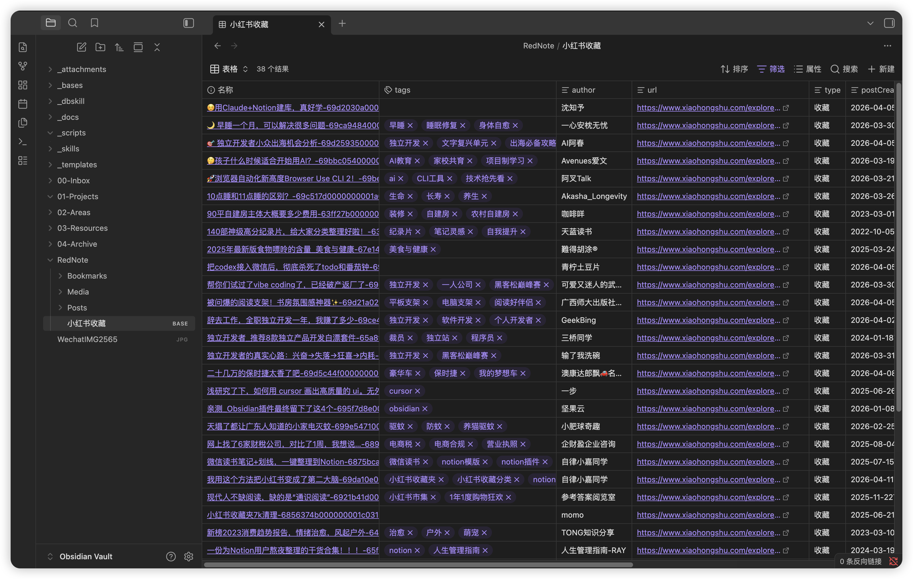

# RedNote Sync for Obsidian · 小红书同步

> 把小红书的**收藏、个人帖子、点赞**自动同步进 Obsidian Vault，图文 / 视频 / 标签 / 专辑一并落库。

[English](./README-en.md) · 简体中文 · [官网 rednote.2notion.com](https://rednote.2notion.com)



> ⚠️ **本插件为闭源软件**：仅以编译产物（混淆后的 `main.js`）形式分发，源代码不开放，禁止再分发、逆向或二次修改分发。详见 [LICENSE](./LICENSE)。

---

## 功能

| 能力 | 说明 |
|------|------|
| 📥 内容同步 | 收藏、个人帖子、点赞三类内容同步到本地 Markdown |
| 🖼 图片下载 | 帖子配图下载到本地，离线可读 |
| 🎬 视频下载 | 可选把视频下载到本地（默认仅嵌入远程链接） |
| 🏷 标签同步 | 帖子标签写入笔记 frontmatter |
| 📂 专辑分目录 | 收藏按专辑分子目录，支持专辑白名单筛选 |
| ⏱ 定时同步 | 后台按间隔自动增量同步 |
| 🌐 国内 / 海外双站 | 自动识别 xiaohongshu.com 与 rednote.com |
| 📊 互动数据 | 点赞 / 收藏 / 评论 / 分享数写入 frontmatter，可用 Dataview / Bases 排序筛选 |
| 💬 评论同步 | 可选同步前 10 条热门评论（每条含最多 3 条回复），折叠块附在笔记末尾 |
| 🤖 AI 分类 | 用 OpenAI 兼容模型把笔记自动归入自定义分类目录 |
| 📷 图片转文字 | 视觉模型识别图片文字（OCR），图文卡片内容变为可搜索文本 |
| 🎙 视频逐字稿 | 视频语音转文字，支持百炼 / 火山引擎 / 腾讯云 / OpenAI 兼容多家转写服务，可再用 AI 整理分段并生成要点总结 |

## 界面预览

<!-- TODO: 录制 GIF 放到 assets/ 后替换下面占位 -->
<!--  -->
<!--  -->

## 安装

### 方式一：BRAT（推荐，可自动更新）

1. 在 Obsidian 社区插件中安装 **BRAT**（Beta Reviewer's Auto-update Tool）并启用
2. 打开 BRAT，选择 **Add Beta plugin**
3. 输入仓库地址：
   ```
   https://github.com/EwingYangs/rednote2obsidian
   ```
4. 安装完成后，在 **Obsidian 设置 → 第三方插件** 中启用 **RedNote Sync**

> BRAT 会跟随 GitHub Release 自动检测并更新到最新版本。

### 方式二：手动安装

1. 到 [Releases](https://github.com/EwingYangs/rednote2obsidian/releases) 下载最新版本的 `main.js`、`manifest.json`、`styles.css`
2. 在 Vault 的 `.obsidian/plugins/` 下新建文件夹 `rednote2obsidian`，把三个文件放进去：
   ```
   你的Vault/.obsidian/plugins/rednote2obsidian/
   ├── main.js
   ├── manifest.json
   └── styles.css
   ```
3. 重启 Obsidian，在 **设置 → 第三方插件** 中启用

> `.obsidian` 是隐藏文件夹：macOS 按 `Cmd + Shift + .` 显示隐藏文件；Windows 在资源管理器勾选「显示隐藏的项目」。

## 使用

启用后进入 **设置 → RedNote Sync**：

1. 点击「登录小红书」，在弹窗中登录后点「登录完成，提取 Cookie」
2. 配置根目录、同步间隔、每批数量、同步内容（收藏 / 个人帖子 / 点赞）等
3. 打开「定时自动同步」即可后台增量同步

完整配置项与说明见 [使用指南](./USER_GUIDE.md)。

## 免费额度与授权码

- 免费试用 **100 篇**，无需任何注册即可使用全部功能
- 累计同步超过 100 篇后，在设置页填写**授权码**即可继续同步
- 授权码可在设置页「购买授权码」入口或[官网](https://rednote.2notion.com)获取，按设备绑定

## 使用须知

本插件仅用于将你**本人账号**有权访问的内容同步到**个人 Obsidian 知识库**，方便个人离线阅读与整理。

- ❌ 禁止用于批量爬取、抓取他人数据，或任何未经授权的数据采集
- ❌ 禁止将同步所得内容用于商业用途或公开再传播，需遵守小红书平台协议及相关法律法规
- ⚠️ 使用者需对自己的使用行为负责，因违规使用造成的一切后果由使用者自行承担

## 隐私与授权

- 小红书登录 **Cookie 仅保存在你本地的 Vault 中**，不上传任何服务器
- 同步的内容只写入你本地的 Obsidian Vault
- 仅授权码本身与设备标识会发送至授权服务校验有效性（用于额度与授权管理）

## 更新日志

### v1.2.0（2026-07-28）

- 📊 **互动数据入属性**：点赞 / 收藏 / 评论 / 分享数写入 frontmatter（纯数字，`"1.2万"` 自动解析为 `12000`），可用 Dataview / Bases 排序筛选
- 💬 **评论同步**：新增开关，同步前 10 条热门评论（每条最多 3 条回复），以折叠块附在笔记末尾，含昵称 / 点赞数 / 日期
- 📷 **图片转文字**：视觉模型识别笔记图片文字（最多前 10 张），图文卡片内容变为可搜索文本；视频笔记自动跳过封面
- 🎙 **视频逐字稿**：视频语音转文字，支持百炼 paraformer / 火山引擎 / 腾讯云 ASR / OpenAI 兼容（whisper、SenseVoice）四类转写服务
- ✨ **逐字稿 AI 整理**：自动分段清洗、修正标点、去除口头禅，并生成「📌 要点」总结
- ⚙️ **AI 模型配置整合**：所有 AI 凭证与模型集中到独立设置区，视觉模型 / 转写配置均带一键测试按钮
- 🐛 修复：适配小红书视频流新编码分组（视频笔记丢视频问题）；登录成功后设置页立即刷新用户名

### v1.1.x

- 白名单专辑增量同步、分批同步修复、专辑白名单筛选、视频下载开关等（详见历次 Release）

## 反馈

使用问题或建议欢迎提 [Issue](https://github.com/EwingYangs/rednote2obsidian/issues)，或访问[官网 rednote.2notion.com](https://rednote.2notion.com)。

## 许可

**闭源软件**。本插件仅以编译产物形式分发，源代码不开源，禁止再分发、逆向工程或修改后分发。详见 [LICENSE](./LICENSE)。
